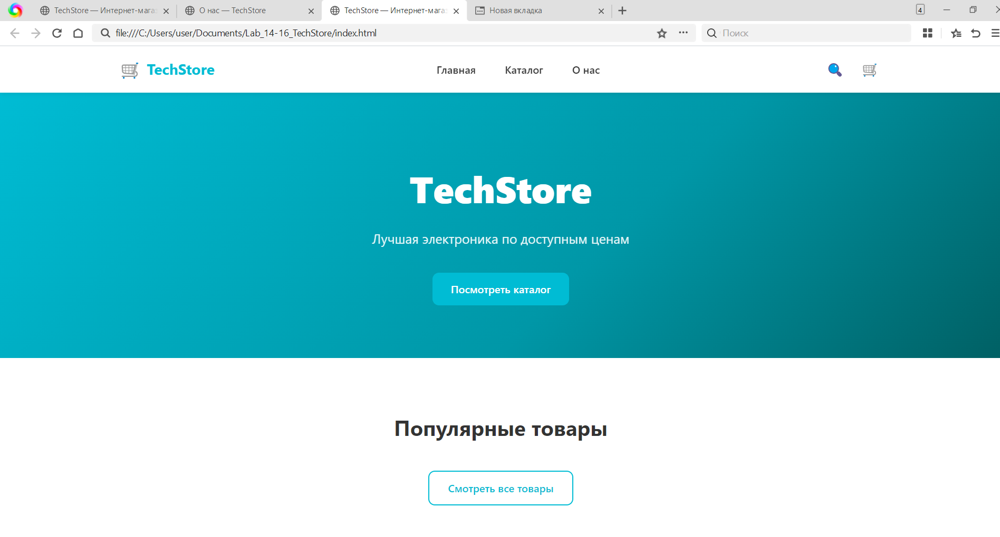
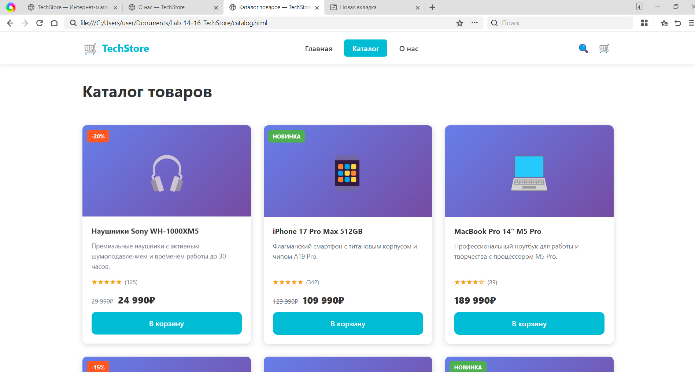
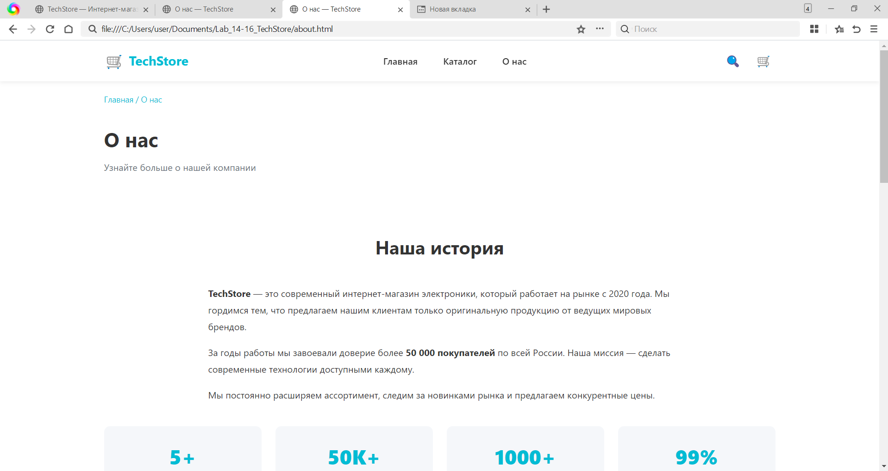

# Лабораторная работа №14-16 - Интернет-магазин "TechStore"
 
ФИО: Плеско Д Д.
Группа: ИСП-231
Дата: 25.05.2026
 
## Описание проекта
Многостраничный сайт интернет-магазина электроники "TechStore"
с адаптивной вёрсткой.
 
## Реализованные страницы
- **Главная** — приветственный баннер, популярные товары, преимущества
- **Каталог** — сетка из 9 карточек товаров
- **О нас** — информация о магазине и команде
 
## Реализованные функции
- Адаптивное навигационное меню
- Карточки товаров с hover-эффектами
- CSS Grid для каталога (3 колонки → 2 → 1)
- Flexbox для навигации и футера
- Адаптивная вёрстка (desktop/tablet/mobile)
- Единая цветовая схема и типографика
- Семантическая HTML5-разметка
 
## Технологии
- HTML5
- CSS3 (Flexbox, Grid, Media Queries)
- Git/GitHub
 
## Скриншоты

 
## GitHub Pages
https://github.com/dplesko2007/Lab_14-16_Techstore
